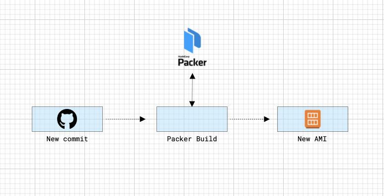
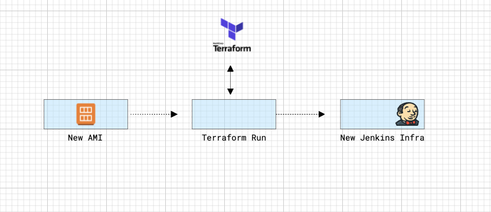

## Work in progress - expect incorrect docs and flaky workflows :D 
----

## BRIEF DESCRIPTION

This repository contains the infrastructure code and configurations needed to automate the provisioning of Jenkins, pipelines, agents, secrets, and the required AWS components/services.

The platform takes advantage of 4 main tools/systems:

- Terraform
- Packer + Ansible
- Jenkins CASC 
- Jenkins DSL 

Although the infrastructure's demo is based on AWS, this design can work in every cloud provider.<br><br><br>


## CONCEPTS

The approach I have decided to use is "Immutable infrastructure", and a clear split between CI & CD.
Where the CI is performed by Packer and the CD by Terraform.

Packer is used to build the images (Jenkins master and agent AMIs) and Terraform to deploy/configure the AWS infrastructure.
<br><br>

### Jenkins Master: AMI creation with Packer + Ansible
<br>



<br>
With the code defined in `/images/*/` packer will create a new AMI with our Jenkins Master (or Agent) and its dependencies pre-configured in it.

When you run `./run.sh create-image master` a Docker image with packer in it will be created and execute Packer, which will:

1. Create a temporary EC2 instance
2. Connect to the instance and execute the ansible playbook defined here -> `/images/master/ansible/playbook`
3. Save a new AMI from the configured EC2 and destroy the instance.
4. Output some metadata to a file called `/images/master/manifest.json`
<br><br><br>

**NOTE**: The same logic is applied for the Jenkins Agent AMI.

### Jenkins CASC:

Jenkins CASC is a Jenkins plugin which allows you to configure Jenkins and its plugins from a YAML file.
More info about it can be found [here]('https://github.com/jenkinsci/configuration-as-code-plugin').

Using Jenkins CASC we will create a seed job which will then create all the other pipelines needed within Jenkins.
In this example, a seed job is a Jenkins freestyle job that can create other jobs using the Jenkins DSL Plugin.
(see: https://plugins.jenkins.io/job-dsl/)<br><br><br>


### Jenkins Master: Infrastructure provisioning with Terraform
<br>



If you know Terraform already, I have done nothing out of the ordinary here.

Terraform will perform the following actions:

- Create a IAM Role + IAM Policy (Necessary for the Jenkins to connect to the AWS Services. E.g.: Secret manager, EC2, etc.) <br>

- Create the PEM Keys (With RSA Algorithm) <- This are the keys used for the master & agent SSH connections. <br>

- Save the early created keys to AWS Secret Manager <br>
  (**NOTE: Using the Jenkins AWS Credential plugin the agents SSH key will be automatically be created as credentials within Jenkins**) <br>

- Render and upload the CASC file (`/terraform/templates/jenkins.yaml.tpl`). <br>
  **NOTE:** <br>
  Jenkins using CASC will create a credential called "jenkins-agent-key-pair" which is needed by Jenkins Clouds to provision Agents automatically. <br>
  The content of the actual key is stored in AWS Secret Manager by Terraform itself and is accesible by Jenkins using the configured IAM role. <br>
  However since the name of the secret, in AWS Secret Manager, changes at every Terraform run, I needed to template the CASC configuration, making the value of ${jenkins-agent-key-pair} dynamic. <br>

- Provision the required Security Groups.

- Create the EC2 Instance to host the Jenkins Master and deploy the rendered jenkins.yaml (CASC file) inside it.
<br><br><br>


### JClouds

Using clouds, a Jenkins 2 functionality, Jenkins will be able to deploy agents on-demand and destroy them when they're not needed, **automatically**.

You'll also be able to tell Jenkins (from the CASC configuration) which AMI use to spawn user, hence you'll be able to use MacOs, Windows, or Linux instances as Jenkins agents.

Through CASC you can also ensure that a minimum of X agents will always be alive.

The Jenkins Clouds is configured here: $URL
<br><br><br>


## Getting started

### Requirements:

* Docker >= 20.10.0
* AWS CLI Installed and configured (Tested with aws-cli/2.1.13)


### Tutorial

- Create AWS keys with admin access & clone this repo:

```
git clone https://github.com/ish-xyz/jenkins-aws-platform.git ~/jenkins-aws-platform
```
<br>

- Create a file called ~/jenkins-aws-platform/.credz:

```
vi ~/jenkins-aws-platform/.credz
```
```
export AWS_SECRET_ACCESS_KEY={{ CHANGE_ME }} <- aws-credential
export AWS_ACCESS_KEY_ID={{ CHANGE_ME }} <- aws-credential
export AWS_DEFAULT_REGION=eu-west-1
```
<br>

- Run the following command to create your Jenkins admin password:

```
cd ~/jenkins-aws-platform
source .credz
aws secretsmanager create-secret --name 'jenkins-master-admin-user' --secret-string 'admin-password' 
```
<br>

- Create the Jenkins master image. To do build the image I've prepared a custom script which creates a docker container and runs Packer within it.

```
./run.sh create-image master
```
<br>

- Create the Jenkins slave image:

```
./run.sh create-image agents/default
```

- **IMPORTANT**: Edit the file `terraform/variables.tf` with "your AWS account values"
<br><br>

- Deploy Jenkins. Running the following command will execute a `terraform apply` on the terraform folder.
```
./run.sh deploy
```
<br>

- Destroy the infrastructure. Running the following command will execute a `terraform destroy` on the terraform folder.

```
./run.sh destroy
```
<br><br>

## Considerations
<br>

### Is this demo production-ready?
<br>

Short answer: no. The porpuse of this demo is to give you an idea on how to innovate your Jenkins setup and ensure reliability through automation. There are several missing parts in this installation, but I do believe it's a good starting point for everyone. Here some of the things you may want to improve before using this code in production:

1. A more strict IAM Role & Policy
2. There's no TLS Certificate
3. AMI used have no security hardening
4. You may want to do a review of the installed plugins and related security issues.
4. Jenkins authentication should be an external user management system (ldap, oauth, etc.)
5. To Keep this demo as simple as possible I have used a script to orchestrate Packer & Terraform. Ideally you should orchestrate your CI/CD workflows from a proper CI/CD tool (Yes, even if you're deploying your CI/CD platform :D).
6. At the moment I'm using a workaround to remove the agents when I run `terraform destroy`. Ideally, you'd have to make Terraform interact with Jenkins to tear down the whole infrastructure or code a self-destruct system into the agents (The second option is preferred, in my opinion).
7. Terraform is not using any remote backend. I strongly advice to use a remote state file instead of the local one for a production implementation.

## TODO

- Use jenkins CLI to install plugins
